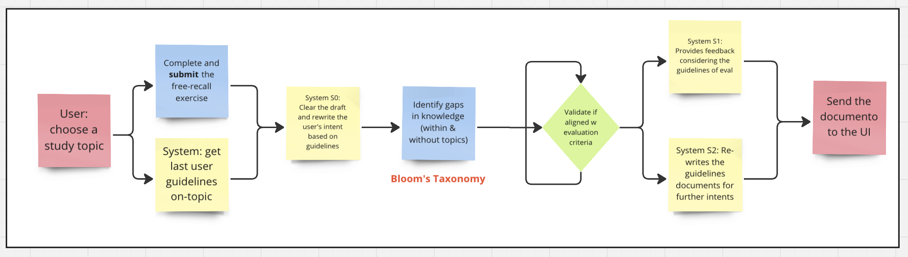
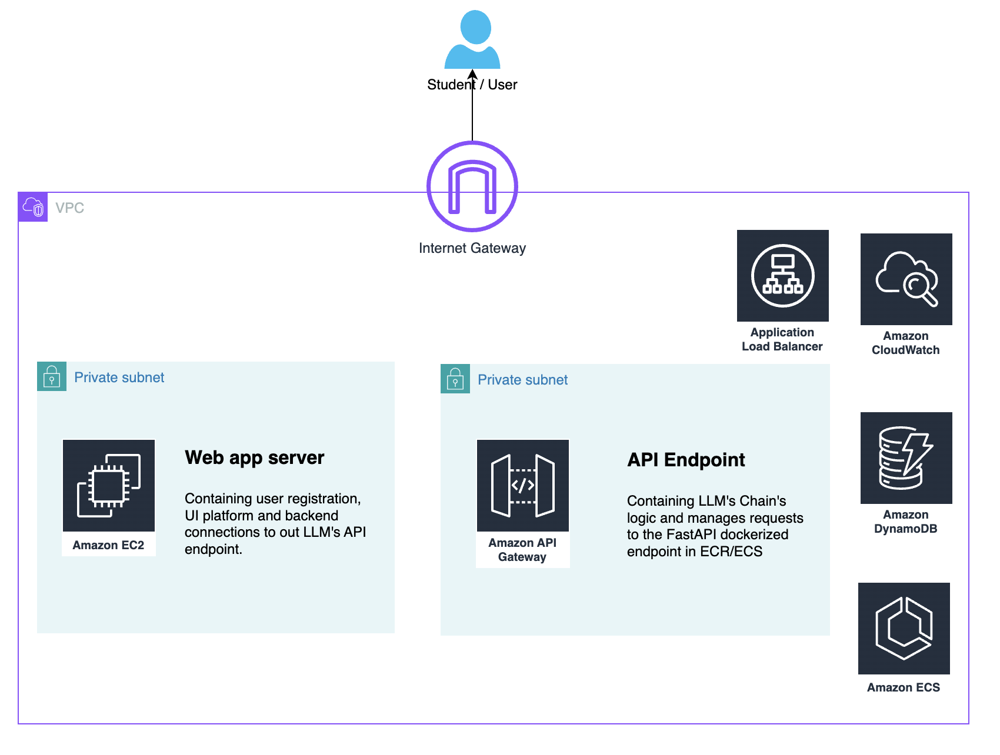

# Learning Assistant

## Description

This is a wrapper for LLM calls that will help the user to improve their knowledge in directions that they are interested in.
The project is still in development and the current version is a prototype.

## Product:

To define where the improvement is going we could use the [Bloom's Taxonomy](https://www.coloradocollege.edu/other/assessment/how-to-assess-learning/learning-outcomes/blooms-revised-taxonomy.html) which defines six levels of cognitive learning. Based on this we can improve the system towards each specific subfield. In specific this helps also the system to maintain a JSON protocol communication making it more aligned and with control. You can see the sample in ```sample_data.json```.

This is an overview of the MVP:



You can see screenshot of the current version below and run the fastapi with the following command:

```bash
uvicorn api_layer.main:app --reload
```

Dont forget to add your OPENAI API KEYS in a .env file in the root of the project.

.env file example:

```bash
OPENAI_API_KEY=your_api_key
```

#### Production proposal:
Stack: AWS, Python, Docker

